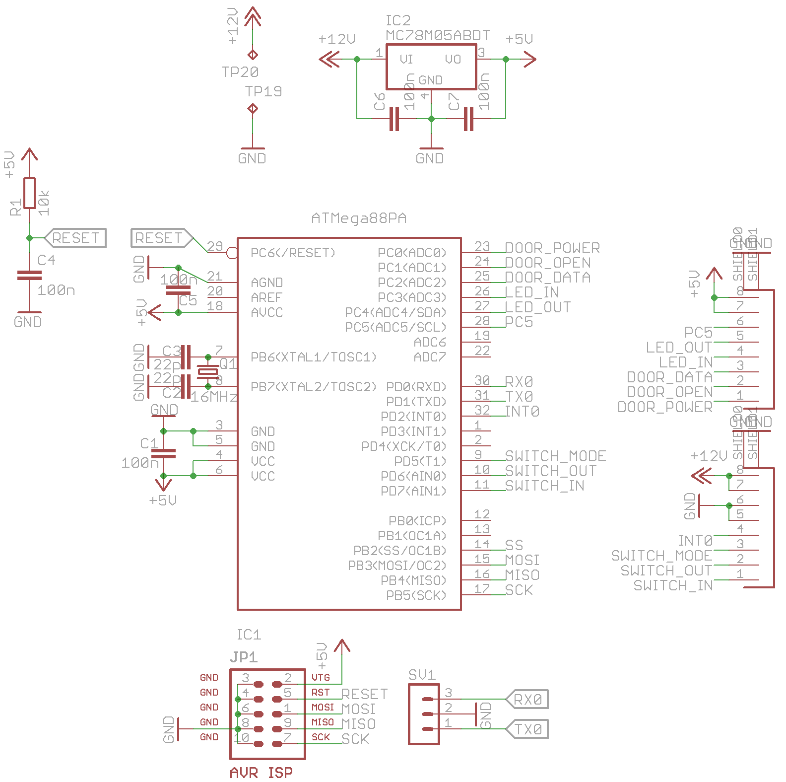
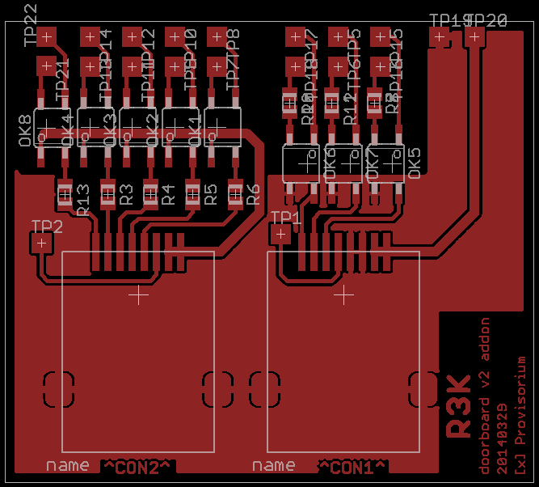

# Türsteuerung
Can haz digitale Türsteuerung mit verschiedenen Inputs und Statusleds und
foo? Ja!

Die [Tür des Chaosdorf](https://wiki.chaosdorf.de/Chaosdoor) hat einen 
eingebauten Motor von Fuhr - den Multitronic 881 und da alle Funkanwendungen
(insbesondere der Funk-Fingerabdrucksensor) auf unbekannter Technik basieren
und damit erstmal als für einen Hackerspace ungeeignet gelten, muss man das
natürlich selber bauen.

## History
v1 umfasste eine Lochrasterplatine mit AVR ATMega8, der über Optokoppler den
Potentialfreien Eingang des Türmotors ansteuerte. Ein Problem war unter
anderem, dass der komplette Öffnungs- und Schließvorgang incl. Verriegeln
dazu führte, dass nach gerade mal 3 Jahren ein Zahnrad brach.

Die aktuelle v2 mit 'lag halt rum' AVR ATMega88PA trennt eigentliche
Steuerung und Boardinterface auf zwei Platinen auf. Der Mikrocontroller ist
zusammen mit der verbundenen Seagate Dockstar und passendem Netzteil für
alles und Tür in einem Gehäuse. Die Ansteuerung der Tür und das damit
verbundene Problem bleibt bestehen.

[@penma](https://github.com/penma) hat aber dankenswerterweise das
Protokoll der Tür im für unseren Zweck ausreichenden Maße reverse
engineered, um die gewünschte Tagesfallenfunktion auch ohne Zusatzplatine
für wahrscheinlich mehrere hunderte Euro zu erlangen.
Bei v2 wird dafür der Optokoppler für die Tagesfalle genutzt.

## Schaltplan

### μC-Platine

### IO-Platine

## Layout

### μC-Platine

### IO-Platine

